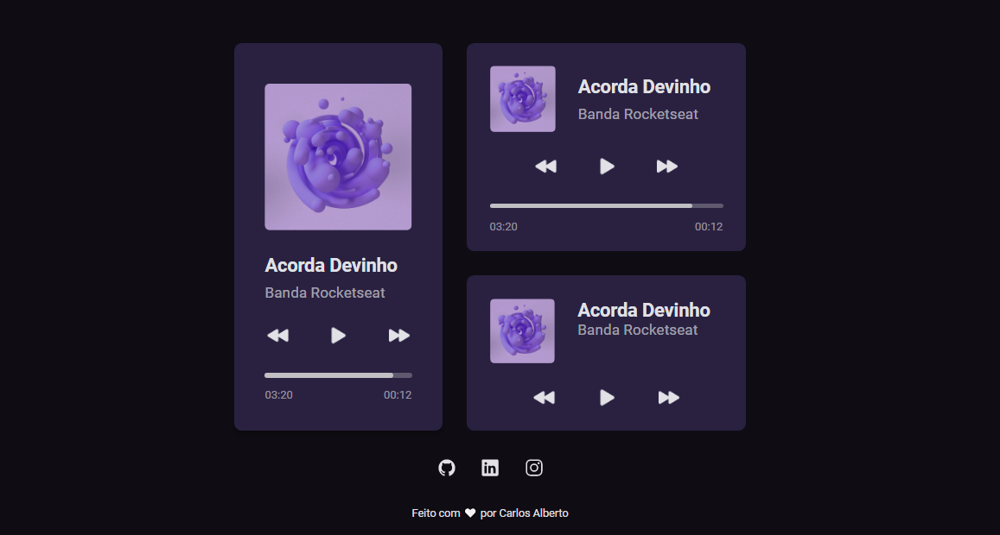

<h1 align="center"> Desafio 01 #boraCodar - Rocketseat  </h1>

 
 
    <a href="#-acesso-ao-projeto">Acesso ao projeto</a>&nbsp;&nbsp;&nbsp;|&nbsp;&nbsp;&nbsp; 
    <a href="#-tecnologias-utilizadas">Tecnologias utilizadas</a>&nbsp;&nbsp;&nbsp;|&nbsp;&nbsp;&nbsp;
    <a href="#-preview">Preview</a>&nbsp;&nbsp;&nbsp;|&nbsp;&nbsp;&nbsp;  
    <a href="#-links">Links</a> 
  

  
  
 
    
 
 
  
  
  
  ## 🖼️ Preview
  
  <h1 align="center">
  
  </h1>
  
  ## 📁 Acesso ao projeto
  
  Você pode acessar o [PROJETO](https://github.com/carlosalbertojusto/bora-codar-desafio-01).
  
  ## ✔️ Tecnologias Utilizas
  
 - ``HTML`` 
 - ``CSS`` 

  ## 🧾 Resumo do projeto
  
  Desafio 01 #boraCodar da Rocketseat - Player de música 
  
  Live site URL :  [Desafio 01 #boraCodar - Rocketseat ](https://carlosalbertojusto.github.io/bora-codar-desafio-01/)
  